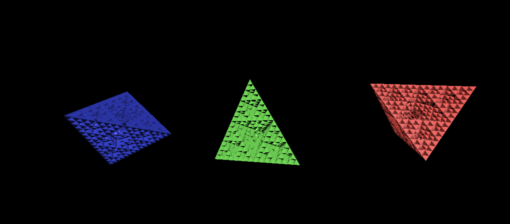
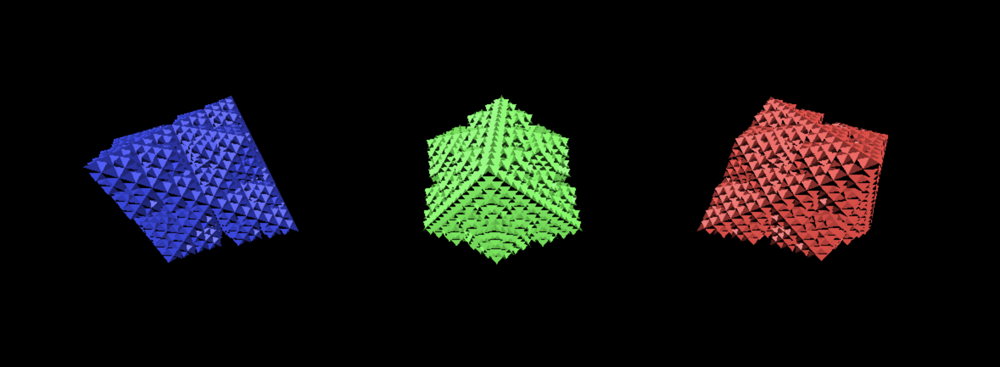

Tetrahedron
-----------

I had some ideas about how I could recursively subdivide the faces
of a tetrahedron and produce something like a Menger sponge but with
triangular holes in a tetragedron instead of square holes in cube.

I wanted to write a bit of code to test out the math I sketched out to
see what the shape would look like. It turned out different than I expected,
but still kind of cool.

It looked like this:

This was rendered in JS Fiddle I found online that uses Three.js. I just dumped
the geometry I genereated into it. Here's a copy that rendered the above:

https://jsfiddle.net/qof68bmk/show

This turns out to be similar to a Sierpinski pyramid, but with less open
air. The difference is that instead of replacing one pyramid with 4 in an
arranged pattern each step, I'm cutting a smaller pyramid out of each face.

The original idea was actually something like a 3D Koch-curve, so there
would be pyramid protrusions rather than cutaways, but it didn't look as
cool so I just flipped the height by -1 and liked that result better.

Here's what the protrusion version looked like:

